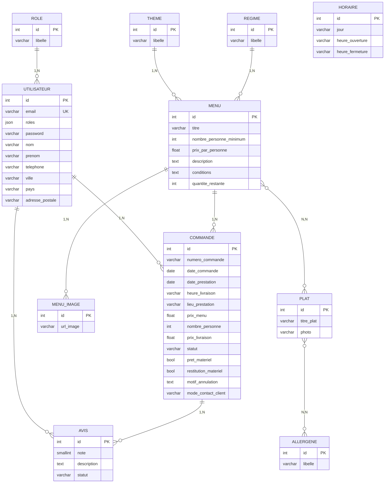

# Modele Conceptuel de Donnees - Vite et Gourmand

## Diagramme Entite-Relation (MCD)

## Description du modele

La base de donnees relationnelle PostgreSQL de l'application Vite et Gourmand repose sur **11 entites** interconnectees. Au centre du modele, l'entite **Menu** constitue le pivot principal : chaque menu est rattache a un **Theme** (Noel, Paques, classique, evenement) et a un **Regime** alimentaire (vegetarien, vegan, classique). Un menu est compose de plusieurs **Plats** (entrees, plats, desserts) via une relation ManyToMany, permettant a un meme plat de figurer dans plusieurs menus. Chaque plat peut etre associe a plusieurs **Allergenes** reglementaires (14 allergenes majeurs) via une seconde relation ManyToMany. Les **MenuImages** constituent la galerie photo de chaque menu (relation OneToMany).

Cote utilisateurs, l'entite **Utilisateur** est liee a un **Role** (utilisateur, employe, admin) qui determine ses droits d'acces. Un utilisateur authentifie peut passer des **Commandes** sur un menu, avec suivi de statut (en attente, accepte, en preparation, en livraison, livre, terminee). Apres livraison, il peut deposer un **Avis** (note de 1 a 5 et commentaire) soumis a validation par un employe.

L'entite **Horaire** est independante et stocke les horaires d'ouverture hebdomadaires affiches dans le pied de page du site.
